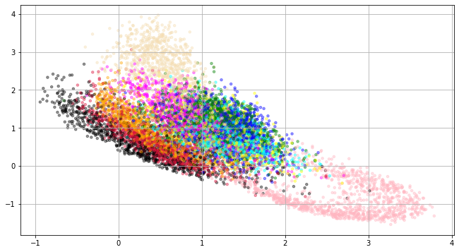

# VAE
This repos contains simple VAE implementation.

All experiments were performed on MNIST dataset. 

### Visualization of latent space from VAE

Different colors represent different classes - digits from 0 to 9. 
